# 多节点 Ping 测速与网络监控平台

一个面向企业和个人开发者的**开源、多节点网络测速与监控平台**。

本项目致力于帮助企业以更低的成本快速搭建自己的网络质量监控、Ping 测速、多节点探测及网络运维平台，同时提供完整的 Agent 管理、消息调度、广告位管理等能力。

我们希望通过开源，让更多优秀的开发者、企业和有想法的人参与进来，共同完善项目，也期待与更多伙伴探索技术、产品和商业上的合作机会。

---

## ✨ 开源与合作
### 开源协议

OKPing 基于 **GNU Affero General Public License v3.0（AGPL-3.0）** 开源。

我们希望 OKPing 能够成为一个开放、持续发展的网络质量监控平台，欢迎开发者基于本项目进行学习、优化、二次开发和功能扩展，也欢迎将改进后的代码贡献回社区。

你可以自由地：

- 使用 OKPing
- 修改源代码
- 二次开发
- 增加新的功能
- 修复和优化现有功能
- 自行部署
- 用于个人或商业项目

但使用、修改和再发布本项目时，需要遵守 **AGPL-3.0** 协议的相关要求。

如果你基于 OKPing 修改代码并通过网络向其他用户提供服务，也需要按照 AGPL-3.0 的要求向相应用户提供对应的源代码。

请保留项目原有的版权声明、许可证声明以及相关第三方版权声明。

**OKPing、OKPing Logo、okping.net 等品牌、商标及相关商业标识不属于本开源许可证的授权范围。**

完整许可证内容请参见项目根目录的 `LICENSE` 文件。

### 合作
项目完全开源，希望能够帮助更多优秀、有想法、有创造力的开发者一起学习、改进和发展。

如果你基于 OKPing 进行了新的功能开发、二次开发或者形成了新的应用场景，也欢迎与我们交流。

同时，我们也提供**付费二次开发、项目部署及系统维护服务**。

如果你需要：

* OKPing 二次开发
* 功能定制
* 企业业务系统对接
* 项目部署
* 服务器环境配置
* 系统故障排查
* 项目维护
* Agent 节点部署
* 生产环境部署

可以通过以下邮箱联系：

**📧 [okpingnet@outlook.com](mailto:okpingnet@outlook.com)**

**📧 [WhatsApp：ndhello](https://wa.me/ndhello)**

> **开源使用说明：**
>
> 项目可以自由使用和进行二次开发，但请保留项目底部的版权信息及相关开源声明。
>
> 我们希望在保持开源精神的同时，也让项目的来源和贡献者能够被正确地记录和认可。

---


# 🏗️ 项目架构

项目采用前后端分离以及 **Master + Agent + Message Queue** 的整体架构。

```text
                         ┌─────────────────────┐
                         │       用户端         │
                         │       Next.js       │
                         └──────────┬──────────┘
                                    │
                                    │ API
                                    ▼
                         ┌─────────────────────┐
                         │       主控端         │
                         │    RuoYi-Vue-Plus   │
                         │                     │
                         │ 用户 / 权限 / 任务   │
                         │ 节点 / 数据 / 广告   │
                         └──────────┬──────────┘
                                    │
                              RabbitMQ
                                    │
                    ┌───────────────┼───────────────┐
                    │               │               │
                    ▼               ▼               ▼
             ┌────────────┐  ┌────────────┐  ┌────────────┐
             │   Agent 1  │  │   Agent 2  │  │   Agent N  │
             │ Blackbox   │  │ Blackbox   │  │ Blackbox   │
             │   Agent    │  │   Agent    │  │   Agent    │
             └────────────┘  └────────────┘  └────────────┘
                    │               │               │
                    ▼               ▼               ▼
                  Ping            Ping            Ping
                 TCPing          HTTP             DNS
               Traceroute       ......          ......
```

### 核心组件

| 组件     | 技术                                        |
| ------ | ----------------------------------------- |
| 用户端    | Next.js                                   |
| 管理端    | Vue                                       |
| 主控端    | RuoYi-Vue-Plus                            |
| Agent  | Prometheus Blackbox Exporter 二次开发         |
| 消息中间件  | RabbitMQ                                  |
| IP 地址库 | ip2region                                 |
| 网络探测   | Ping / TCPing / HTTP / DNS / Traceroute 等 |

---
## 📷项目截图
### 用户端部分
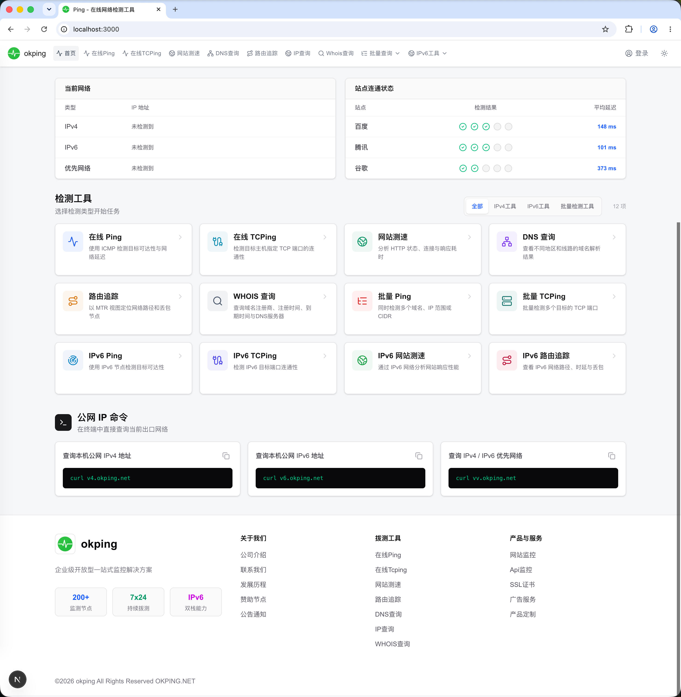
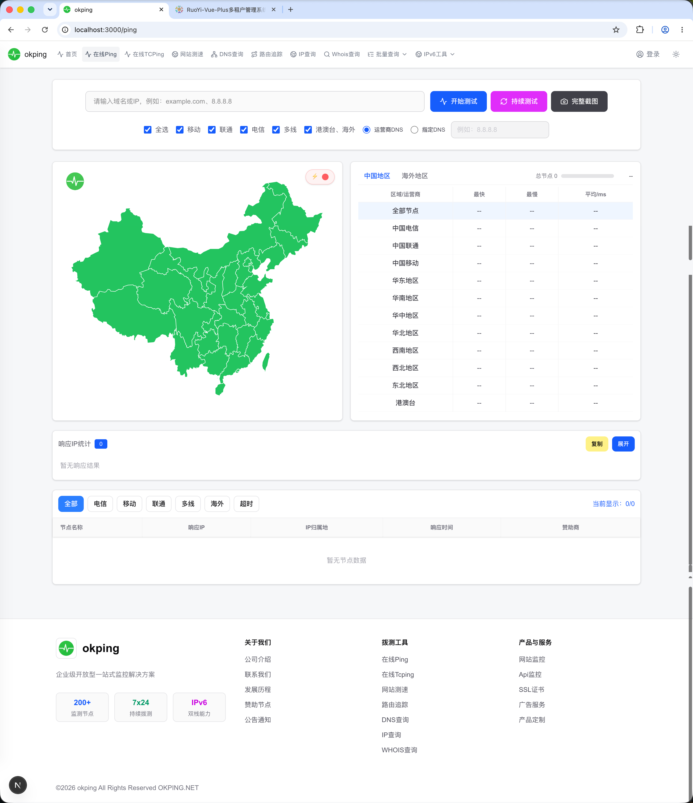
### 管理端
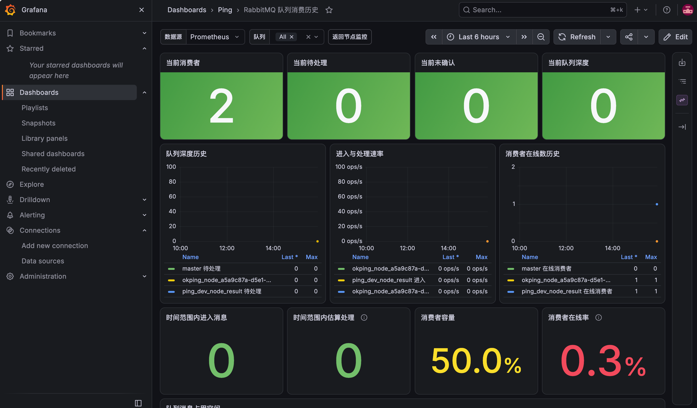
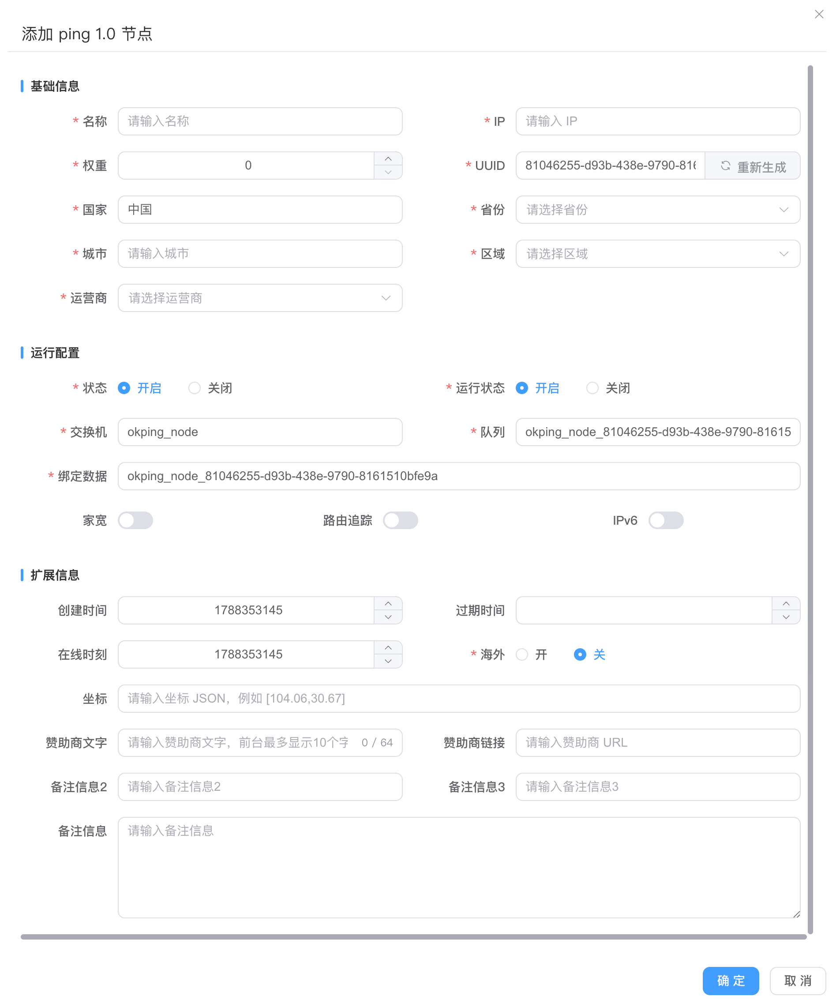
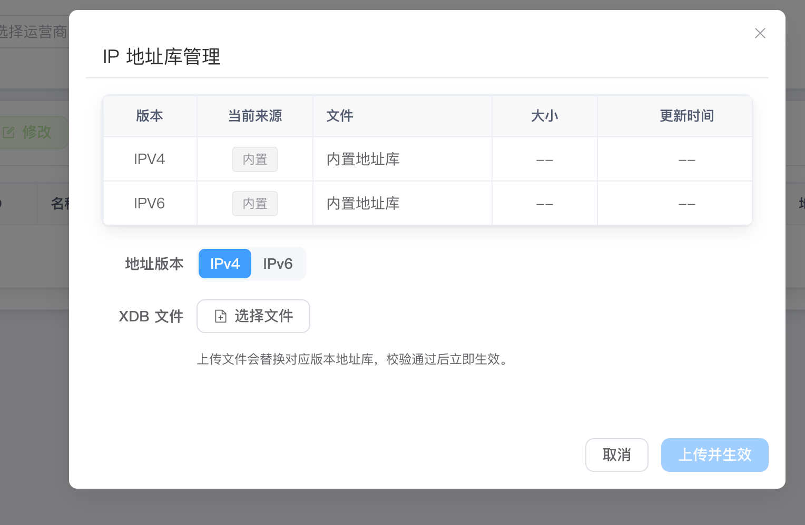
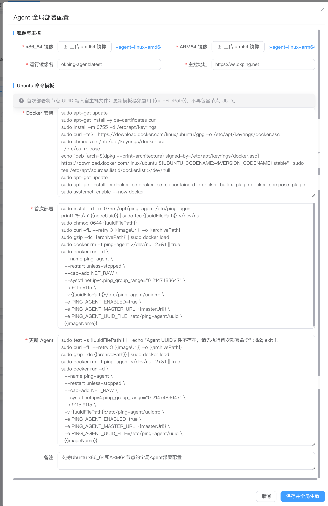
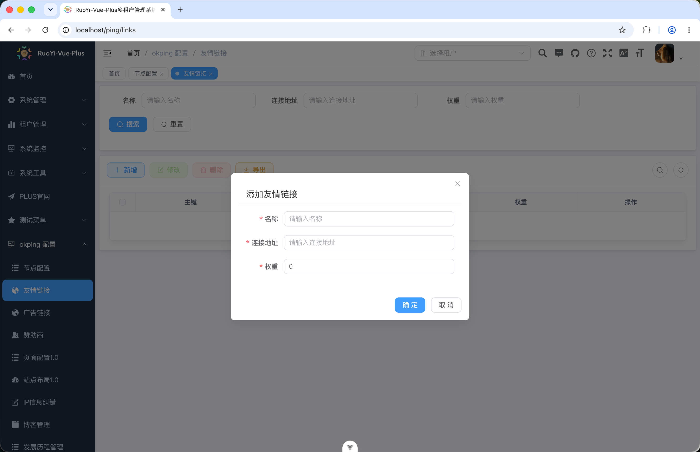
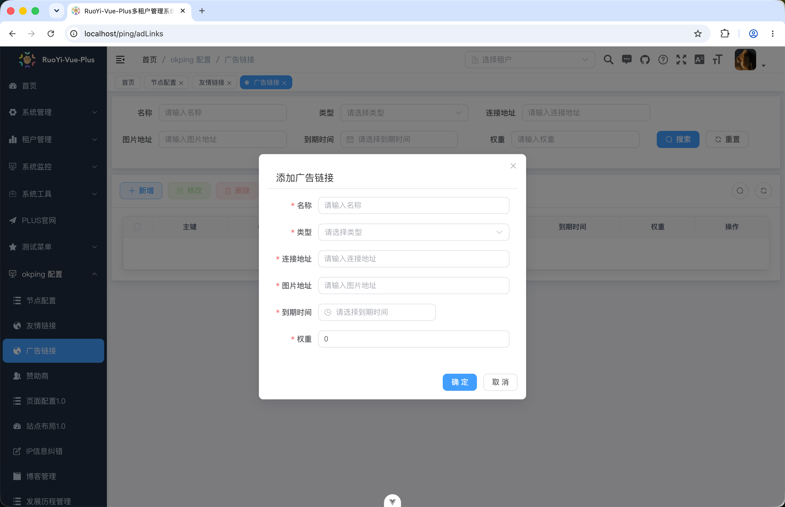
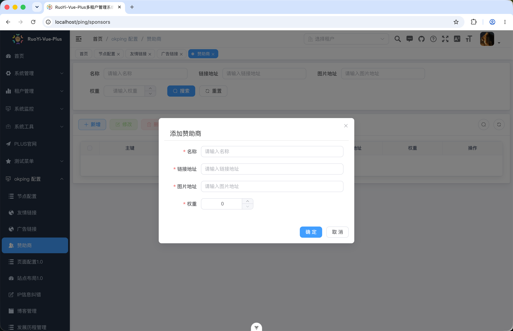
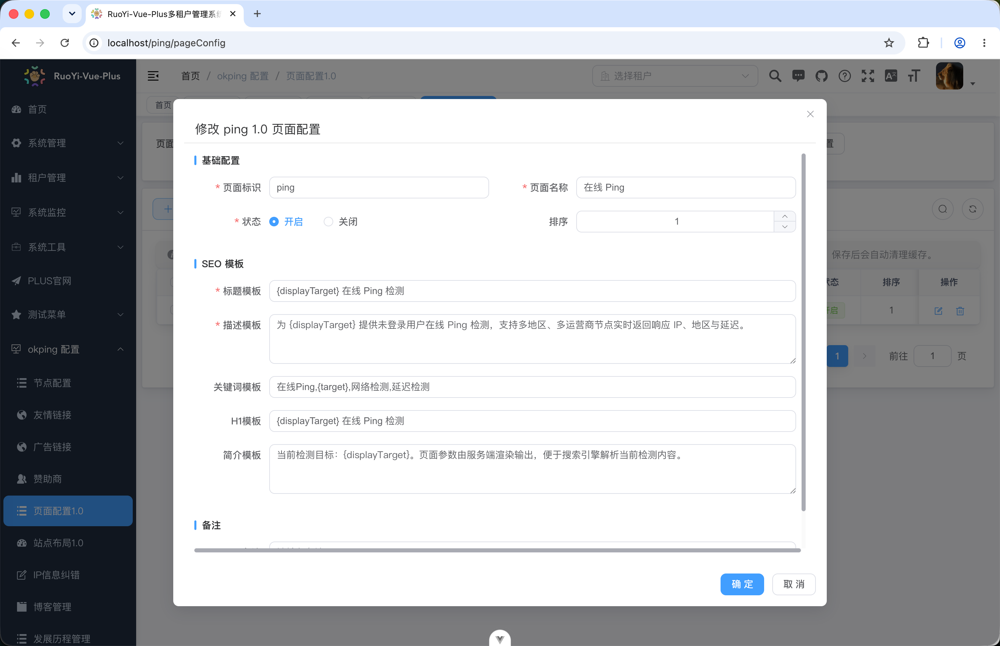
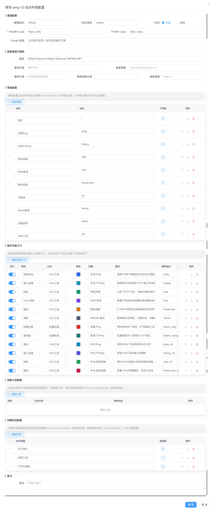
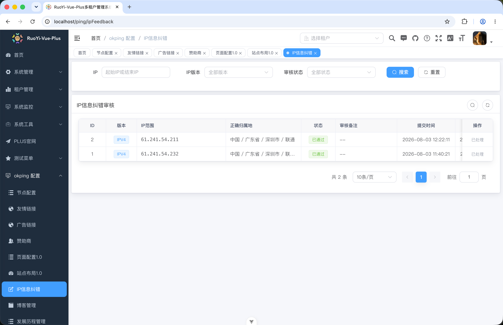
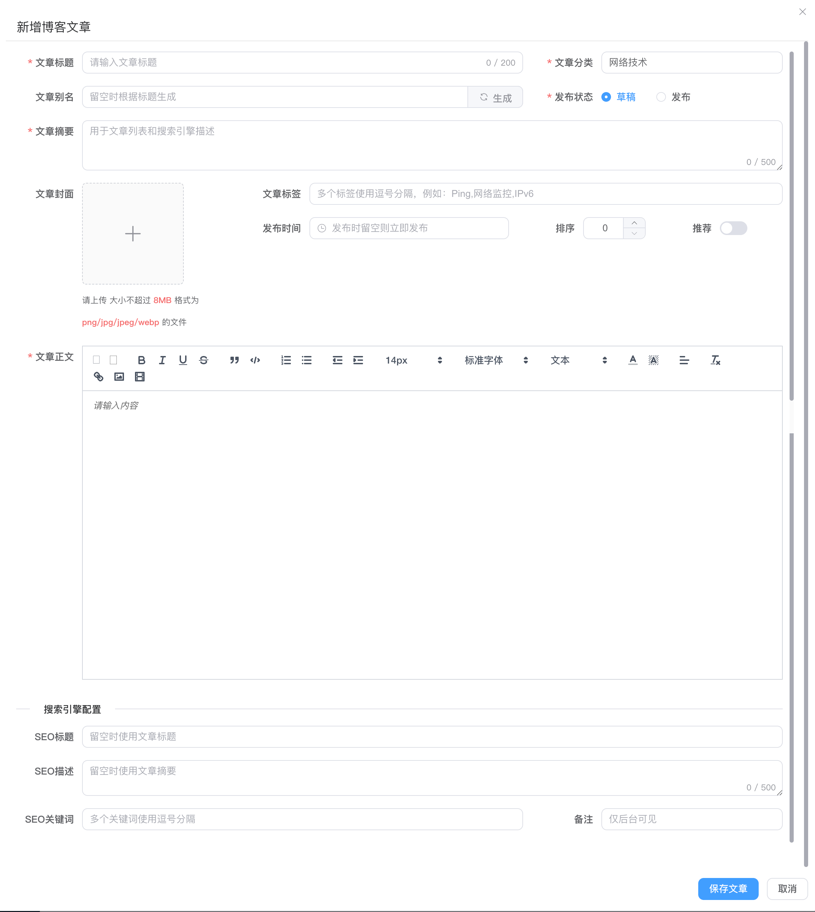
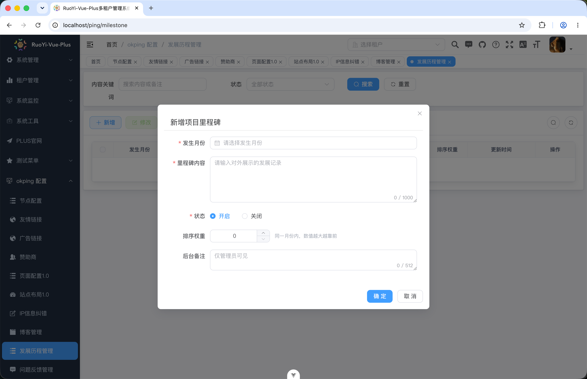
# 🚀 核心功能

## 多节点网络测速

平台支持部署多个不同地域、不同网络环境的 Agent。

用户可以从不同节点发起网络测试，从而了解目标地址在不同地域、不同运营商网络环境下的访问质量。

支持的探测能力包括：

* Ping
* TCPing
* HTTP
* DNS
* Traceroute
* IPv4
* IPv6

通过多节点探测，可以更加真实地了解网站、API、服务器以及网络服务在不同地区的网络质量。

---

## 🤖 Agent 自动上下线

Agent 内置节点状态检测机制。

平台能够自动识别 Agent 当前状态：

```text
Online
   │
   │ 心跳正常
   ▼
正常运行
   │
   │ 心跳超时
   ▼
Offline
```

无需管理员手动维护节点状态。

当 Agent 出现：

* 服务器宕机
* 网络中断
* Agent 异常
* 服务停止
* 节点不可达

等情况时，平台能够自动识别节点状态变化。

---

## ⚡ Agent 一键部署

项目提供 Agent 一键部署能力。

通过主控端生成对应的部署配置，用户可以快速在目标服务器部署网络探测 Agent。

降低传统监控系统中：

```text
下载程序
    ↓
修改配置
    ↓
安装依赖
    ↓
配置服务
    ↓
启动程序
    ↓
配置节点
```

这一系列复杂操作的门槛。

目标是让没有复杂运维经验的用户，也能够快速完成监控节点部署。

---

# 🌍 IP 地址库

项目集成 **ip2region** IP 地址库，并支持 IP 库的修改和上传。

可以根据实际业务需求更新 IP 数据，从而实现更加灵活的 IP 地理位置解析。

可用于：

* IP 地理位置
* 国家 / 地区识别
* 城市识别
* 节点地域展示
* 节点地图
* 网络访问来源分析

---

# 📢 全局广告系统

项目内置完整的全局广告能力。

广告系统不仅支持普通页面广告位，同时可以根据平台业务场景进行更加细粒度的广告配置。

### 页面广告位

支持在不同页面配置广告内容，例如：

```text
首页
├── 顶部广告
├── 内容区域广告
└── 底部广告

Ping
├── 顶部广告
└── 测试结果广告

监控
├── 页面广告
└── 节点相关广告
```
### SEO 优化能力

用户端采用 Next.js，并与主控系统结合，实现 SEO 配置能力。

管理员可以通过主控系统配置相关 SEO 信息，由用户端动态使用。

包括：

* 页面 Title
* Description
* Keywords
* SEO 页面内容
* Open Graph 等页面信息

通过这种方式，可以让企业在使用网络监控系统的同时，拥有更加完善的网站 SEO 能力。
### 节点广告位

平台支持针对节点设置广告位。

可以根据不同节点、不同区域以及不同业务需求进行广告展示。

这使得项目不仅可以作为一个单纯的开源监控系统使用，也可以作为企业自己的网络监控与流量运营平台进行二次开发。

---

# 💡 助力企业低成本建站

我们希望这个项目解决的不仅仅是“如何进行 Ping 测速”。

对于很多企业来说，搭建一套完整的网络监控平台通常需要：

* 前端开发
* 后端开发
* 管理后台
* 用户系统
* 权限系统
* 节点系统
* Agent
* 消息队列
* 监控系统
* 数据展示
* 广告系统
* 运维部署

从零开始开发，需要投入大量的人力和时间。

本项目希望通过开源的方式，将这些基础能力提前建设完成。

企业可以直接基于项目进行：

```text
开源项目
    ↓
部署
    ↓
配置自己的 Agent
    ↓
接入自己的业务
    ↓
二次开发
    ↓
形成自己的网络监控平台
```

从而降低企业技术投入和开发成本。

---

# 🧩 适合哪些场景？

本项目适合：

### 企业网络监控

监控企业网站、API、服务器以及关键业务系统的网络质量。

### IDC / 云服务商

部署多个地域节点，为客户提供网络质量测试能力。

### SaaS 平台

基于项目进行二次开发，构建自己的网络监控 SaaS。

### 开发者

学习：

* Next.js
* Vue
* Java
* RuoYi-Vue-Plus
* RabbitMQ
* Prometheus
* Blackbox Exporter
* 分布式 Agent
* 多节点监控架构

### 创业项目

可以直接在开源项目基础上开发自己的产品，而不需要从用户系统、管理后台、节点管理等基础功能重新开始。

---

# ❤️ 为什么开源？

我们认为：

> **优秀的项目不应该只属于一个人。**

开源的意义不仅仅是免费使用代码，更重要的是让更多拥有想法的人能够参与进来。

我们希望通过开源：

* 让更多开发者参与项目
* 让更多优秀的想法得到实现
* 共同完善项目
* 分享技术经验
* 降低企业技术成本
* 寻找更多合作机会
* 探索更多产品可能性

如果你有新的想法、功能建议或者商业合作方向，非常欢迎参与项目。

也许一个简单的 Issue、一个 Pull Request，或者一次交流，就能够让这个项目变得更好。

---

# 🤝 寻找合作

我们欢迎以下形式的合作：

* 技术合作
* 产品合作
* 企业合作
* SaaS 合作
* 节点资源合作
* 网络资源合作
* 项目二次开发
* 商业化合作

如果你正在寻找一个开源的网络监控基础平台，或者希望基于本项目开发自己的产品，欢迎联系我们。

---

# 📚 文档

详细使用文档：

* Ping 测速
* TCPing
* HTTP
* DNS
* Traceroute
* 多节点监控
* Agent 部署
* 节点管理
* 监控任务
* 告警配置
* 广告配置

请查看项目官方文档。

---

# 📄 开源声明

本项目坚持开源精神。

在使用、修改和二次开发本项目时，请遵守项目所采用的开源协议及相关第三方项目协议。

特别感谢以下优秀的开源项目：

* RuoYi-Vue-Plus
* Prometheus
* Blackbox Exporter
* RabbitMQ
* ip2region
* Vue
* Next.js

感谢所有开源项目的贡献者。

---

## ⭐ 如果项目对你有帮助

如果这个项目对你的工作、学习或创业有所帮助，欢迎：

* Star 项目
* 提交 Issue
* 提交 Pull Request
* 分享项目
* 提出新的想法
* 与我们进行合作

**让更多优秀的人参与进来，一起把事情做好。**

---

<div align="center">

**Open Source · Build Together · Grow Together**

**开源 · 共建 · 共赢**

Copyright © OKPing

</div>
